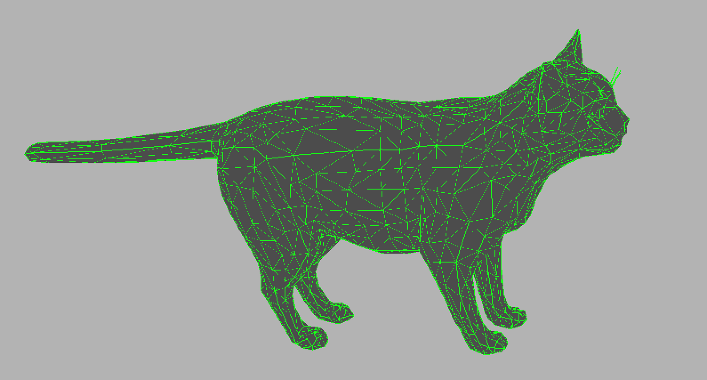
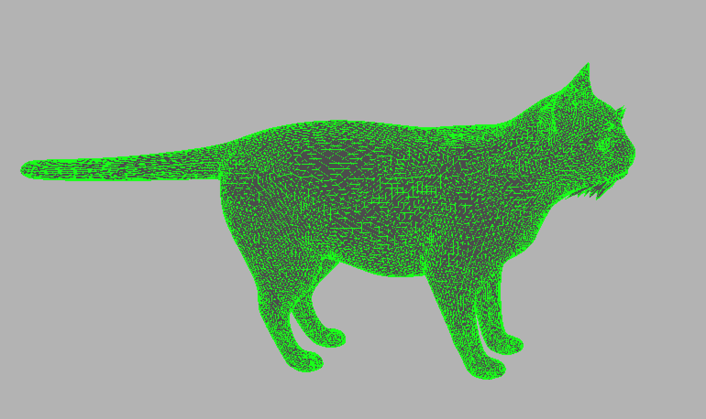

# Assignment 1
## Alex Craig

### Technical Description
My subdivision contains two main loops. One loop goes through every triangle, and the other loop is nested in each triangle. The first loop gets the vertices of each triangle and stores them as `tri_original` and initializes a `tri_new` that will store the vertices of the new triangle. The nested loop fills then out the `edge_vtx_map`, `edge_tri_map`, and the `vtx_vtx_map`. The nested loop also adds the midpoints of the edges of the original triangle as vertex's for a new triangle. Outside of the nested loop, I then add four new triangles to `new_tri`, making sure that the edges are in the correct orientation.

The next part of the function loops through the `edge_vtx_map` and adjusts the position of each new vertex (which will always be the old edges' midpoints) to be the weighted average of the each edge's vertices, and its two incident vertices, if they exist. 

Finally, the last part of the function loops through the `vtx_vtx_map` and adjusts the position of each old vertex to be the weighted average of the each vertex's incident vertex's. The average is weighted by a `beta` factor which is calculated based on the number of incident vertices. 

### Creative Expression
I found a low poly .obj file of a cat online that I ran the subdivision function on. I have a pet cat so this model reminded me of him. His name is Jack.

Here is the link to the cat file: [link](https://free3d.com/3d-model/low-poly-cat-46138.html)

Here are the results:

Original Cat:

Subdivided Cat:
