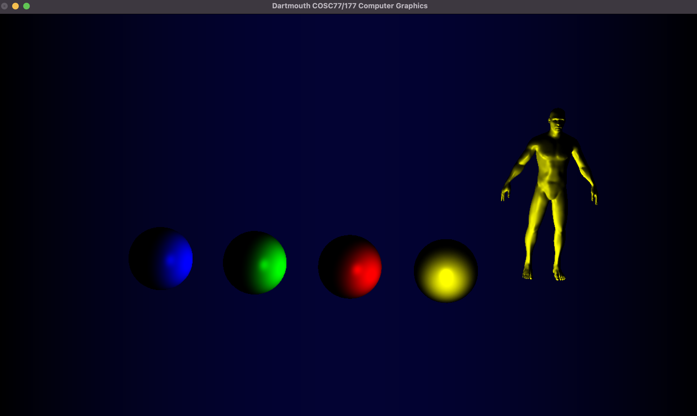

# Assignment 2

## Alex Craig

### Step 0 - Messing Around:

For step 0, I messed around with passing sin and cos functions into vtx_color. I was able to get a sphere that looked like a magma planet in `0.1` by assigning `vtx_color[i] = Vector4f(sin(i), 0., 0., 1.0);` and a more colorful sphere in `0.2` by assigning `vtx_color[i] = Vector4f(sin(i), cos(i), sin(i / 2), 1.0);`

Image 0.1

Image 0.2

### Step 1 - Normal Calculation:

For step 1, computed the vtx and triangle normals. I created a `vtx_tri_map` that mapped each vertex to all its incident triangles. I then looped through each triangle, calculated and stored its normal vector, and also filled out the `vtx_tri_map`. I then looped through each vertex, and calculated and stored its normal vector as the normalized sum of all of its incident triangles' normal vectors. To visualize this, I displayed the normals as colors of the sphere's surface in `1.1`, and the colors of the bunny's surface in `1.2`.

Image 1.1

Image 1.2

### Step 2 - Lambertian Shading:

For step 2, I implement Lambertian shading. I pass `vtx_norm` and `vtx_pos` from my `.vert` to my `.frag` file. Then, in the `.frag` file, I calculate the ambient and diffuse factors based on hard-coded weights and the dot product of the normal vector direction and the light vector direction, and factor them into the `frag_color`. `2.1` shows the sphere with Lambertian shading.

Image 2.1

### Step 3 - Phong Shading:

For step 3, I implement Phong shading. I pass `vtx_norm` and `vtx_pos` from my `.vert` to my `.frag` file. Then, in the `.frag` file, I calculate the ambient and diffuse factors as I did in step 2, and factor them into the `frag_color`. I also calculate the specular factor based on the dot product of the reflected light vector direction and the eye vector direction, and factor it into the `frag_color`. `3.1` shows the sphere with Phong shading.

Image 3.1

### Step 4 - Different Mesh

For step 4, I loaded in the bunny mesh and applied Phong shading, as shown in `4.1`. I also colored the bunny with the normals and applied Phong shading, as shown in `4.2`.

Image 4.1

Image 4.2

### Step 5 - Light Rotation:

For step 5, I implemented light rotation with my Phong shading. I created a 4-dimensional rotational matrix based on iTime in `my_phong.vert` and use it to rotate `gl_Position`, `vtx_norm`, and `vtx_pos`. Then, in `my_phong.frag`, I rotate `light_pos` based on iTime, then multiply `vtx_color` by the dot product of the direction of the light vector and the normal vector. `5.1` shows the sphere with light rotation. I then changed the position of the light to be directly above the sphere, and so it gave a different rotational effect as shown in `5.2`.

Video 5.1

Video 5.2

### Step 6 - Make a Scene:

To fit the theme "Colors of the Season", I decided to make 4 spheres each with a color that represents a season; red for summer, yellow for fall, blue for winter, and green for spring. I also applied my rotational Phong shading to the scene. I like how it came out, and the scene reminds me of how the Earth's angle to the sun's light changes with each season.

Image 6.1

Video 6.1

