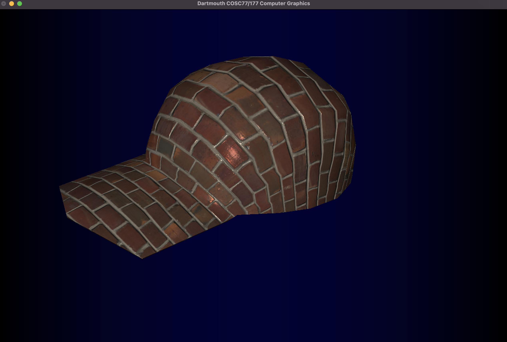

# Assignment 3

## Alex Craig

### Step 0 - UV Coordinates

I used a tan and cos function to create spherical coordinates form UV coordinates. However, doing so in my `main.cpp` resulted in the following error:


I believe this error is related to an edge case where my "last" column of checkerboards not rendering correctly. So I instead calculated my UV coordinates inside my `.frag` file, which fixed this error. I also used the modulus function to map coordinates to either be a U or a V coordinate, to give a checkerboard effect. Here are the results:


### Step 1 - Color Texture

In order to map the albedo texture to the sphere, I used the built in GLSL `texture` function to load in `tex_albedo` and my UV coordinates. I then simply set the frag color to be the texture color. Here are the results:


### Step 2 - Lighting

I also implemented Phong lighting from assignment 2 in `normal_mapping.frag`. I then set `frag_color = vec4(col.rgb * light.rgb, 1.f);` where `col.rgb` represents the albedo texture and `light.rgb` represents the Phong lighting. Here are the results:


### Step 3 - Normal Mapping

The following code is used to calculate the normal vector based on the normal map and follows the algorithm specified in the assignment description:

```
vec3 norm_unit = normalize(vtx_norm.xyz);
vec3 norm = texture(tex_normal, vtx_uv).xyz;
norm = normalize(norm * 2.f - 1.f);

vec3 tangent = normalize(vtx_tan);
vec3 bitangent = normalize(cross(norm_unit, tangent));
mat3 TBN = mat3(tangent, bitangent, norm_unit);

vec3 norm_mapped = normalize(TBN * norm);
```

`norm_mapped` then replaces `norm_unit` in the Phong lighting calculation. Here are the results:


### Step 4 - Texturing a Different Mesh

Here are some examples of different textures I applied to the bunny and cap mesh:





Personally I really like the way the brick texture interacts with the Phong shading.

### Step 5 - Creative Expression

For my creative expression, I wanted to show the same building made with different materials which were popular at different points in time. I managed to find some albedo and normal mappings at [Filter Forge](https://www.filterforge.com/). One technical challenge was figuring out how to apply different textures to different meshes in the same scene. I solved this by looping through each mesh in the scene, and assigning its texture based on its index in the loop. The result shows the "evolution" of building materials from old to new:


