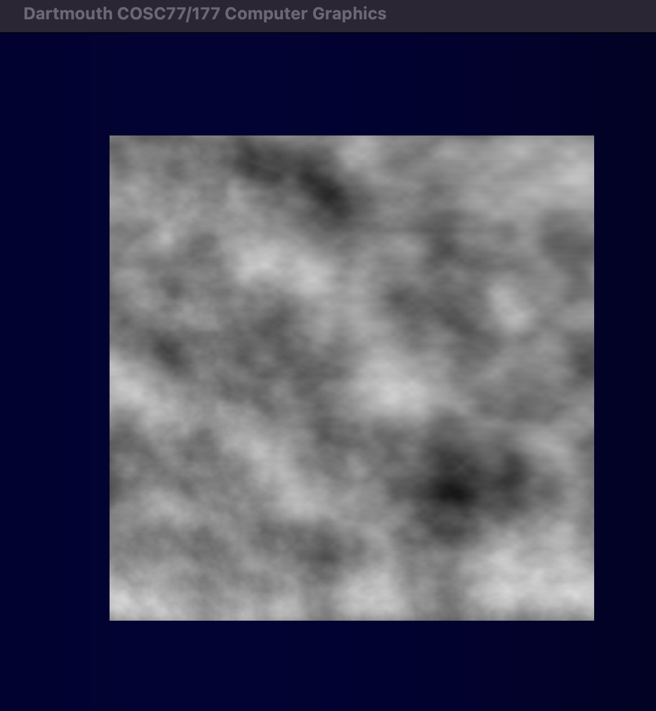
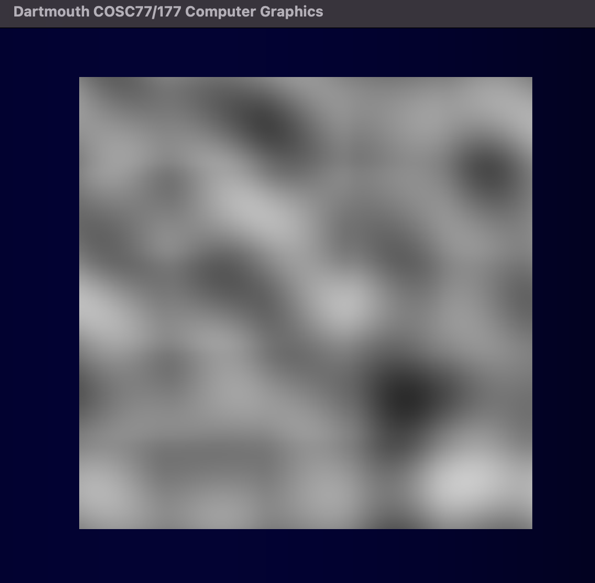
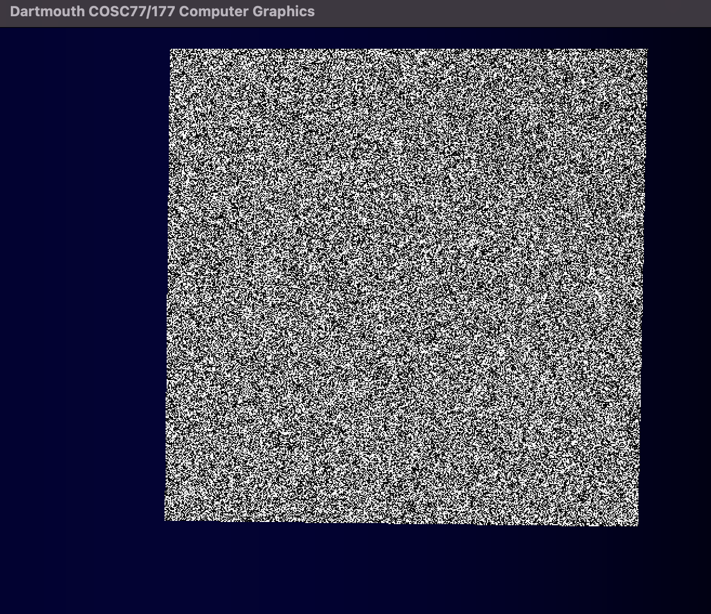
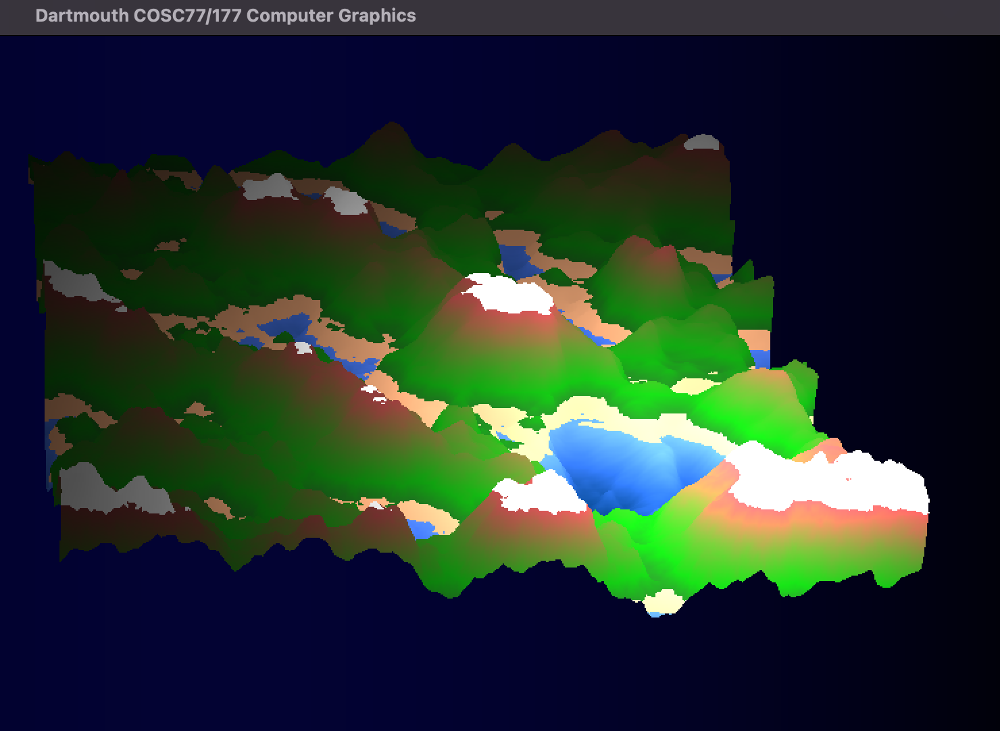
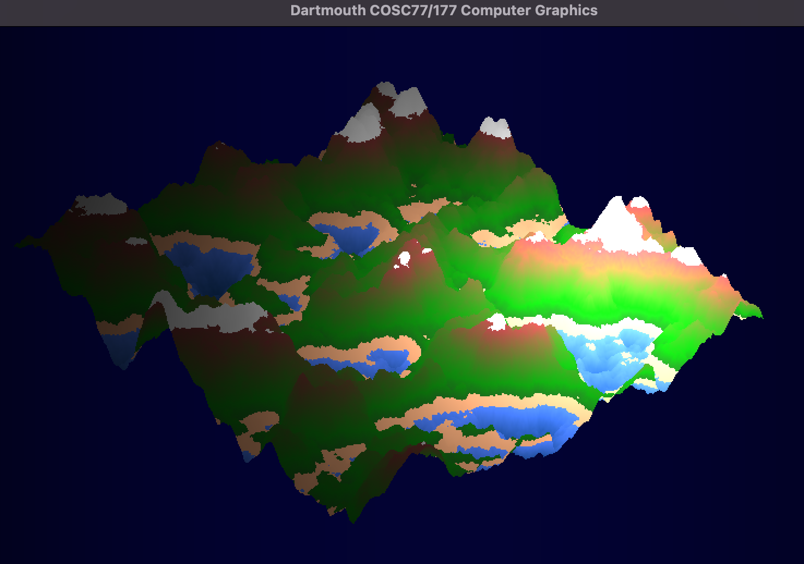
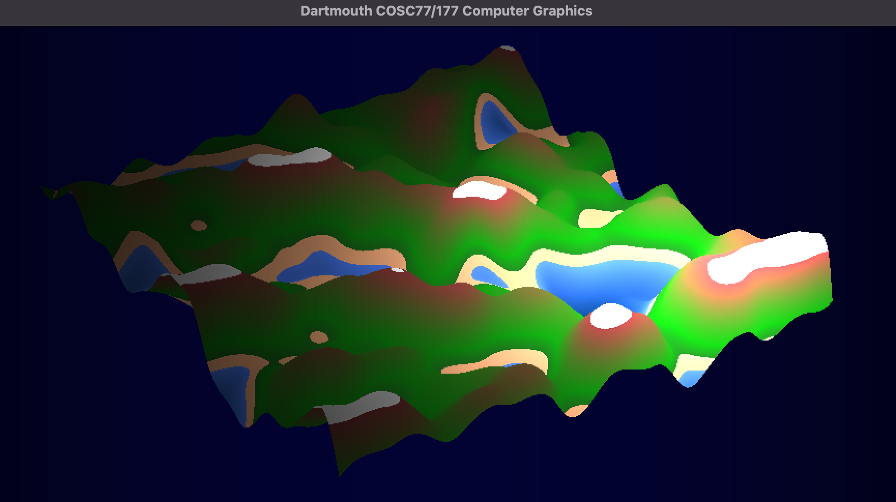

# Assignment 4

## Alex Craig

### Step 0 - Perlin Noise

Here is the result of the perlin noise function I implemented in `perlin.frag`:

Here is the result using a lower octave:

Here is the result using pure random noise:

### Step 1 - Terrain Generation

Here is the result of the terrain generation using the perlin noise function:

Here's the result with a different random seed:

### Step 2 - Creative Expression

I chose to use a low octave perlin function to create some cool looking cartoony terrain. Here is the result:

### Advanced Features

For my advanced feature, I used the GLSL `mix` function give a smooth gradient of colors to the terrain. I also used the function `emissiveColor = mix(emissiveColor, vec3(0.5, 0.3, 0.1), pow(abs(vtx_normal.y), 2.0));` to give make the steeper terrain more brown.
