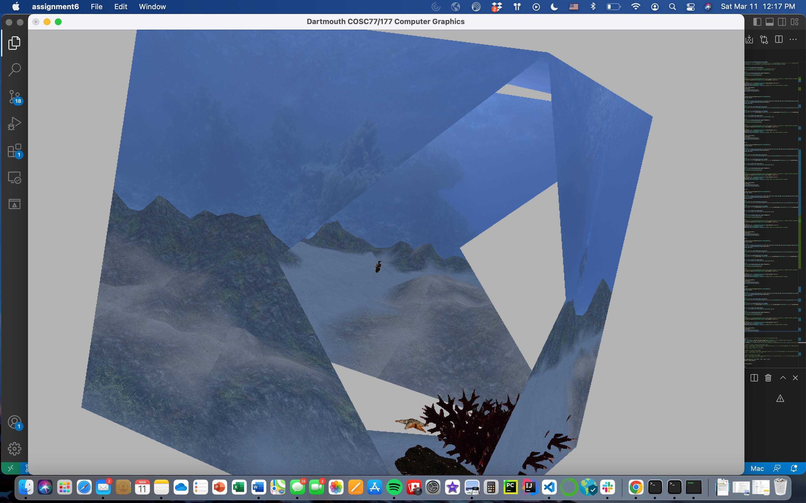
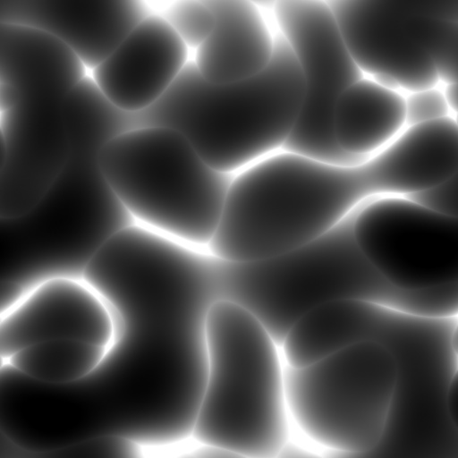
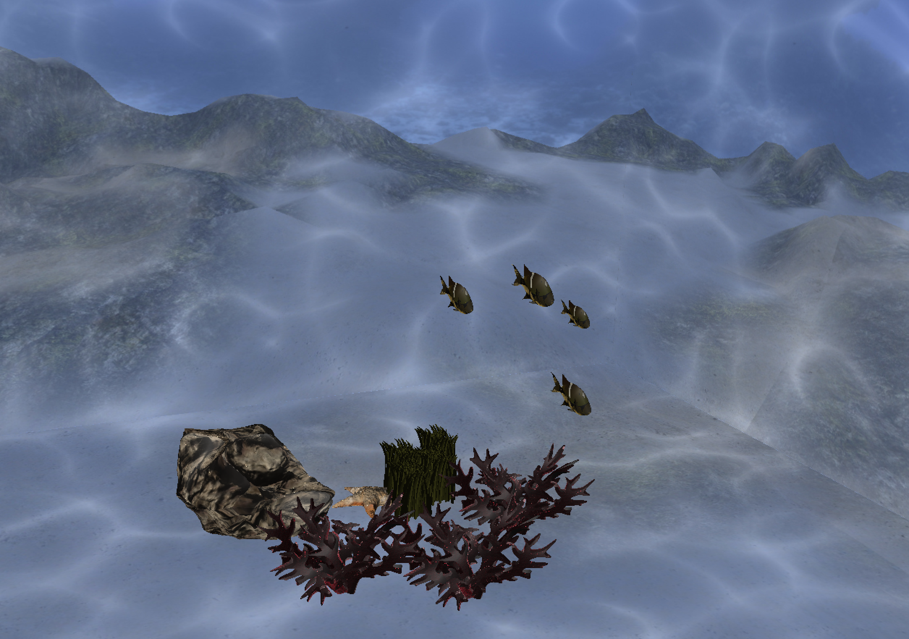

# Final Project Technical Report

## Journey Under the Sea

### Alex Craig & Lindsay Harris

---

## 1. Image Overview

The theme for this project was “journey”. We decided to make an underwater scene of the ocean and its creatures. Alex grew up on the water, sailing, and windsurfing, which has definitely contributed to his journey as a person. Lindsay has always loved the ocean. Recently with climate change and coral bleaching, we have witnessed the horrible destruction of our oceans. This project also served as our remembrance of the ocean, and hopefully its journey back to what it once was. To make our scene, we used a skybox representing the ocean and a caustic effect on each side of the box and all objects to make the underwater scene look more realistic.

## 2. Technical Implementation Details

### 2.1 Skybox

We definitely had some difficulty with implementing the sky box to the starter code given for the assignment, particularly molding the sky box to the use of the object creation methods we were given. Eventually, we settled on using the example from `add_object_3` and making our own meshes for each of the 6 cube faces. This means that we had 6 functions for each of the 6 faces. First, we loaded the shaders and textures with all other shaders and textures. Taking the `skybox_bottom` function as an example, we set up the skybox as follows:
First, we created an interactive object with an `OpenGLTriangleMesh` by calling the `Add_Interactive_Object()` function. Then it gets a reference to the mesh by calling `mesh_obj->mesh`.

Next, we defined the vertices for the triangle by creating a std::vector<Vector3> and set its values to four 3D vectors that define the corners of a square. Then we set the vertices of the mesh to these vertices by assigning the `triangle_vertices` vector to the vertices reference.

After that, we set the vertex colors, normals (which don’t matter for a sky box but was done anyways), and UV coordinates by creating `std::vector<Vector4f>`, `std::vector<Vector3>`, and `std::vector<Vector2>` vectors respectively and assigning them to the corresponding vtx_color, vtx_normal, and uv references of the mesh. We played around with assigning the uv coordinates to match up with the texture images until we got the right combination.

We then set the mesh elements by creating a `std::vector<Vector3i>` vector and assigning it to the elements reference of the mesh. In this case, the mesh consists of two triangles. We also had to play around with the orientation of the triangles so that each triangle was oriented opposite to its neighbor. This is an example of incorrect orientation and triangle creation.



Next, we set up the shader program for the mesh by calling `Add_Shader_Program()` on the mesh object and passed in the shaders obtained from `OpenGLShaderLibrary::Get\*Shader("skybox")`.

Then, we set up the texture for the mesh by calling `Add_Texture()` on the mesh object and passed in the texture for the bottom of the skybox.

Finally, we set up the polygon mode to `PolygonMode::Fill`, set the shading mode to `ShadingMode::Texture`, refreshed the data of the mesh object, initialized it, added it to an array of mesh objects, and returned the index of the new mesh object in the array.
This was done for all 6 faces of the box, with the vertex positions, uv coordinates, and triangles different depending on the face. Every one of these `Add*`functions was called with the other object adders in the`Initialize_Data()`function.

In the`skybox.vert`shader, the gl_Position was calculated using the following:`pvm\*vec4(pos.xyz,1.f)`. And then vertex position, vertex normal, and uv coordinates were passed to the `skybox.frag`shader. In the`.frag`shader, the`frag_color` was produced by the texture of the passed-in texture image based on the uv coordinates. Because a skybox is centered at the origin, there is no need to interpolate the uv coordinates. The depth was then set to 1, so that the skybox would render behind every image.

### 2.2 Caustics

Caustics are the light patterns that are created when light is refracted through water. We implemented caustics by importing a tileable caustic texture, and overlaying that texture onto the albedo of the skybox and different objects. The tileable texture can be foud in `./assets` and looks like this:



In order to overlay the caustic texture, we added it to the fragment shader of each object we wanted to have caustics as `tex_caustic`. Then in those objects' fragment shaders we mapped a `caustic_uv` by adding the regular `uv_vtx` to a time function. We then got the albedo from `tex_caustic` at the position of `caustic_uv` and added that albedo to the fragment's normal color with lighting. This gave the effect of caustics moving across the objects. In the skybox's fragment shader, we also added a second caustic texture to the skybox's albedo. This gave the effect of two caustics moving across the skybox which made the scene look more realistic.

### 2.3 Wave Distortion

To further create the illusion of light refraction through water, we wanted to add a wave distortion effect onto the objects in the scene. We did so by offsetting their uv coordinates x position by a sin function which took the `vtx_uv.y` and `iTime` as parameters. We stored this offset uv coordinate as `tex_uv` and used it to get the albedo and normal from the object's texture. Here is an example of the the wave distortion effect on the rock:

```glsl
  vec2 tex_uv = uv_vtx;
  tex_uv.x += sin(3.0 * uv_vtx.y + 0.1 * iTime) / 20.0;

  col = texture(tex_albedo, tex_uv);
  vec3 norm = texture(tex_normal, tex_uv).xyz;
```

## 3. Solved Challenges

- One big challenge was the orientation of all the triangle meshes for the skybox. It just took some sitting down and drawing out every triangle to be able to fix that.

- Another big challenge was rotating the objects. The column major rotational matrices were difficult. It was difficult to figure out which axis to rotate objects on and also which axis moved the object in what direction. Placing all of the objects in the scene definitely took way more time than we anticipated and led to the scene not being as full as we originally thought it could be.

- A final challenge was figuring out the exact parameters for the wave distortion. We had to play around with the `sin()` function parameters to get the right effect. This [ShaderToy](https://www.shadertoy.com/view/MsX3DN) was a big help in figuring out the right parameters.

## 4. Contributions

- Alex Craig

  - Caustics
  - Wave distortion
  - Object rendering

- 4.2 Lindsay Harris

  - Skybox
  - Lighting
  - Object rendering

## 5. Final Results

We are very proud of our final result. As you can see in `video_0.mp4`, the scene is very realistic and the caustics and wave distortion make it look like you are really underwater. Our favorite part is the starfish hiding between the rock and the sea grass. We are very happy with the way the scene turned out and we hope you enjoy it as much as we do.

### 5.1 Image



### 5.2 Video

<video height=500 width=auto controls>
  <source src="./video_0.mp4" type="video/mp4">
</video>
